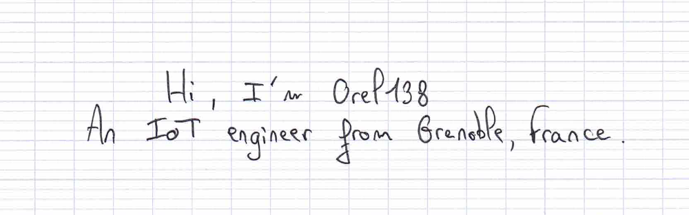

<!-- Beginning of the rendered Markdown -->

<h1 align="center">
  <picture>
    <source media="(prefers-color-scheme: dark)" srcset="assets/banner_dark_theme/dark-banner-1.png">
    <source media="(prefers-color-scheme: light)" srcset="assets/banner_light_theme/light-banner-1.png">
    
  </picture>
</h1>

  

<h3 align="left">Languages and Tools</h3>

> "Your body is a reflection of what you eat" - Me: 🍭

> 🥠 Fortune cookie : Your heart is pure, and your mind clear, and your soul devout.

**353 day before 2025 ⏱** days before new year

  Today's weather for  <b>Grenoble, France</b>: <b>-6°C (felt -9.72°C), clear sky</b>.
  

  The ☀️ rise 🌄 at 08:12 and sets 🌇 at 17:16
  

 

  
  This file is automatically generated every day
  

  
  Last update on Sat Jan 13 2024
  

 

<!-- End of the rendered Markdown -->
<!-- The following content will not appear in the rendered Markdown -->
